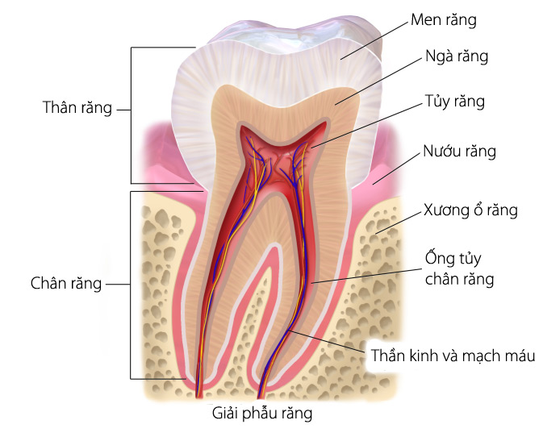

# Răng hàm mặt

Răng Hàm Mặt (RHM) hay còn gọi là Nha Khoa: Chức năng đúng như cái tên ngành nghề của là RHM, đây là ngành chuyên nghiên cứu, chẩn đoán, điều trị các bệnh liên quan đến Miệng và Cấu Trúc Răng bao gồm: – Phục hình tháo lắp răng, – Chỉnh hình răng, – Chuẩn đoán, phẫu thuật, chỉnh hình miệng.

