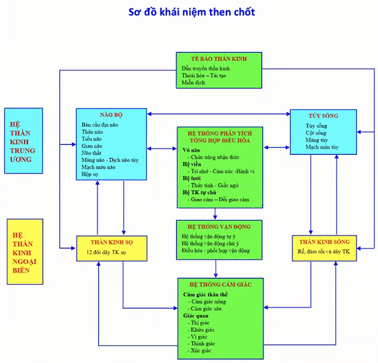

# Thần kinh học

Thần kinh học là một chuyên ngành y học chuyên nghiên cứu về sự rối loạn của hệ thần kinh.

## Nội dung

- [Cranial Nerve Examination](https://youtu.be/sJBpai74tlU)
- [Upper Lim Neurological Examination](https://youtu.be/0hhcxaeOCYs)
- [Lower Limb Neurological Examination](https://youtu.be/-7ERNH_o5Ss)
- [Bài giảng chẩn đoán hình ảnh giải phẫu điện quang não](https://youtube.com/pAaocitehkk)
- [Tai biến mạch máu não do thiếu máu cục bộ](https://youtu.be/0La68fBByJo)
