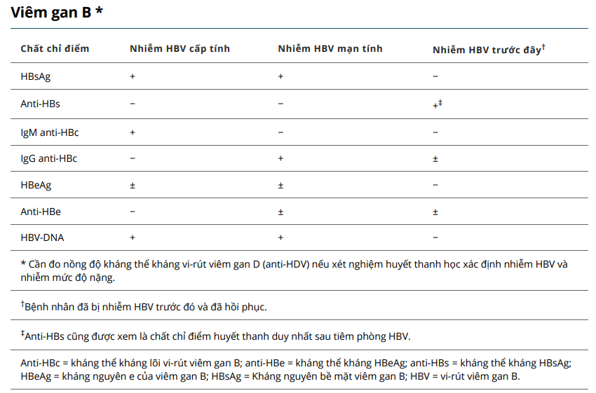
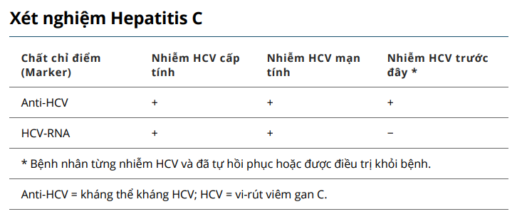

# Lâm sàng truyền nhiễm HPMU

> Tác giả **Long Nhật Nguyễn**.

## Chẩn đoán nhiễm khuẩn huyết

### Cổ điển

|              |                                                                                                                                                                                                                                                                                                                                |
| ------------ | ------------------------------------------------------------------------------------------------------------------------------------------------------------------------------------------------------------------------------------------------------------------------------------------------------------------------------ |
| Dịch tễ      | <li>Yếu tố nguy cơ như tuổi, bệnh nền</li><li>Phẫu thuật</li>                                                                                                                                                                                                                                                                  |
| Lâm sàng     | <li>Sốt</li><li>Hội chứng đáp ứng viêm toàn thân</li><li>Ổ nhiễm trùng (tiên phát, thứ phát)</li>                                                                                                                                                                                                                              |
| Cận lâm sàng | <li>Huyết học có bạch cầu (>12 G/l hoặc <4 G/l hoặc bạch cầu non >10%), tiểu cầu (<100 G/l), INR (>1.5), APTT (>60s)</li><li>Sinh hóa có PCT, CRP, PaO2/FiO2 (<300 biểu hiện rối loạn trao đổi khí máu động mạch hoặc <200 nếu suy hô hấp) bilirubin, ure, creatinin</li><li>Cấy máu là tiêu chuẩn vàng, PCR máu, khí máu</li> |

### Sepsis 2

- Nhiễm khuẩn huyết = SIRS + Bằng chứng nhiễm trùng hoặc nghi ngờ nhiễm trùng
- Nhiễm khuẩn huyết nặng = SIRS + Bằng chứng nhiễm trùng hoặc nghi ngờ nhiễm trùng + Rối loạn chức năng cơ quan
- Sốc nhiễm khuẩn = Nhiễm khuẩn huyết + HAtt <90 mmHg + Lactat >4 = Nhiễm khuẩn huyết + HAtt <40 mmHg so với bình thường + Lactat >4

### Sepsis 3

- Nhiễm khuẩn huyết = Nhiễm trùng + SOFA >=2
- Sốc nhiễm khuẩn = Nhiễm khuẩn huyết + HAdm <= 65 mmHg + Lactat >=2 = Nhiễm khuẩn huyết + HAtb > 65 mmHg + Lactat >=2

## Viêm gan B

### Chi tiết tại [Hướng dẫn chẩn đoán và điều trị viêm gan virus B](../HD-chan-doan-va-dieu-tri-viem-gan-virus-B_BYT.pdf).

### 4 đường lây truyền của virus viêm gan B

- Lây truyền qua đường tình dục.
- Lây truyền qua đường máu.
- Lây truyền từ mẹ sang con trong thời kỳ chu sinh. Ngoại lệ có thể lây qua rau thai và sữa mẹ.
- Lây ngang dùng chung bàn cạo râu, bàn chải đánh răng, khăn mặt.

### Bảng 1. Xét nghiệm huyết học viêm gan B `*` theo [MSD](https://www.msdmanuals.com/professional/hepatic-and-biliary-disorders/hepatitis/hepatitis-b,-acute)

### Bảng giải thích kết quả xét nghiệm viêm gan B

| Tình huống                               | Giải thích kết quả                                     | Hướng giải quyết                                                        |
| ---------------------------------------- | ------------------------------------------------------ | ----------------------------------------------------------------------- |
| HBsAg (-) và anti-HBs (-)                | Không nhiễm viêm gan B và chưa có kháng thể bảo vệ     | Cần tiêm vacine để tạo kháng thể                                        |
| HBsAg (+) và anti-HBs (-)                | Đang nhiễm viêm gan B                                  | Cần khám bác sĩ chuyên khoa gan mật. Không tiêm vacine vì đã nhiễm bệnh |
| HBsAg (-) và anti-HBs (+) (>= 10 mIU/ml) | Đủ kháng thể bảo vệ                                    | Không cần tiêm vacine để tạo kháng thể                                  |
| HBsAg (+) và anti-HBs (+)                | Tình huống này hiếm gặp. BN cũng đang nhiễm viêm gan B | Cần gặp bác sĩ chuyên khoa                                              |

### So sánh viêm gan cấp tính và mạn tính

| Đặc điểm | Viêm gan cấp                                              | Viêm gan mạn (hủy hoại tế bào gan >6 tháng)  |
| -------- | --------------------------------------------------------- | -------------------------------------------- |
| Vi sinh  | Xem bảng 1                                                | Xem bảng 1                                   |
| Hóa sinh | AST, ALT tăng 10-100 lần, trong đó ALT tăng nhiều lơn AST | AST, ALT tăng 2-3 lần và AST tăng sấp sỉ ALT |

### Một số chỉ định trên lâm sàng

- Truyền huyết tương tươi đông lạnh, vitamin K 10 mg x 2 ống/ngày khi prothrombin < 60%. Trong mỗi đơn vị huyết tương tươi đông lạnh có chứa 200ml và theo định nghĩa chứa 1 đơn vị yếu tố đông máu/ml và 1-2 mg fibrinogen/ml. Trong mỗi đơn vị huyết tương tươi đông lạnh có chứa 200ml và theo định nghĩa chứa 1 đơn vị yếu tố đông máu/ml và 1-2 mg fibrinogen/ml.
- Chỉ định điều trị viêm gan B bằng thuốc kháng virus theo Quyết định 3310/QĐ-BYT ngày 29/07/2019.

## Viêm gan C

### Chi tiết tại [Hướng dẫn chẩn đoán và điều trị viêm gan virus C](../HD-chan-doan-va-dieu-tri-viem-gan-virus-C_BYT.pdf).

### Đường lây truyền giống [viêm gan B](#4-đường-lây-truyền-của-virus-viêm-gan-B)

### Bảng 2. Xét nghiệm huyết thanh học của Hepatitis C theo [MSD](https://www.msdmanuals.com/professional/hepatic-and-biliary-disorders/hepatitis/hepatitis-c,-chronic)

## HIV

### Chi tiết tại [Hướng dẫn điều trị và chăm sóc HIV/AIDS](../HD-dieu-tri-va-cham-soc-HIV-AIDS_BYT.pdf).
