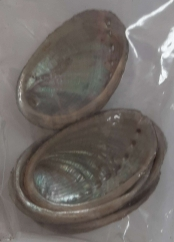
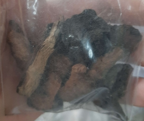
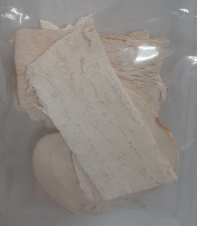
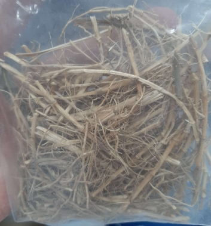
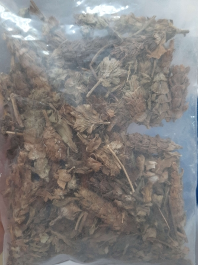
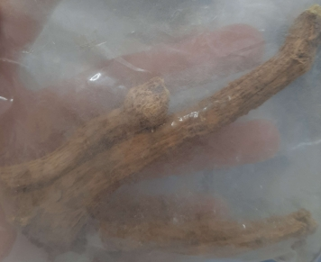

# Một số vị thuốc cổ truyền

> Tác giả **Long Nhật Nguyễn**

## An thần

| Thuốc            | Hình ảnh                          |
| ---------------- | --------------------------------- |
| Bá tử nhân       |        |
| Bình vôi         |          |
| Lá vông nem      |       |
| Lạc tiên         |          |
| Long nhãn        |         |
| Thạch quyết minh |  |
| Toan táo nhân    |     |
| Viễn chí         |          |

## Bổ âm

| Thuốc      | Hình ảnh                  |
| ---------- | ------------------------- |
| Bách hợp   |    |
| Bạch thược |  |
| Câu kỷ tử  |   |
| Mạch môn   |    |
| Ngọc trúc  |   |
| Sa sâm     |      |
| Thiên môn  |   |

## Bổ dương

| Thuốc        | Hình ảnh                       |
| ------------ | ------------------------------ |
| Ba kích      |       |
| Cẩu tích     |      |
| Cốt toái bổ  |   |
| Đỗ trọng     |      |
| Ích trí nhân |  |
| Phá cố chỉ   |    |
| Thỏ ty tử    |     |
| Tục đoạn     |      |

## Bổ huyết

| Thuốc         | Hình ảnh                        |
| ------------- | ------------------------------- |
| Đương quy     |      |
| Hà thủ ô đỏ   |       |
| Kê huyết đằng |  |
| Thục địa      |       |

## Bổ khí

| Thuốc      | Hình ảnh                   |
| ---------- | -------------------------- |
| Bạch truật |  |
| Cam thảo   |    |
| Đại táo    |     |
| Đẳng sâm   |    |
| Hoài sơn   |    |
| Hoàng kỳ   |    |

## Hành khí

| Thuốc         | Hình ảnh                        |
| ------------- | ------------------------------- |
| Bạch đậu khấu |  |
| Chỉ thực      |       |
| Chỉ xác       |        |
| Đại phúc bì   |    |
| Hậu phác      |       |
| Hương phụ     |      |
| Mộc hương     |      |
| Ô dược        |         |
| Sa nhân       |        |
| Trần bì       |        |

## Hoạt huyết

| Thuốc        | Hình ảnh                         |
| ------------ | -------------------------------- |
| Đan sâm      |       |
| Ích mẫu      |       |
| Hồng hoa     |      |
| Khương hoàng |  |
| Ngưu tất     |      |
| Tô mộc       |        |
| Uất kim      |       |
| Xuyên khung  |   |

## Tán phong hàn

| Thuốc     | Hình ảnh                         |
| --------- | -------------------------------- |
| Bạch chỉ  |   |
| Kinh giới |  |
| Ma hoàng  |   |
| Quế chi   |    |
| Tân di    |     |
| Tế tân    |     |
| Tía tô    |     |

## Tán phong nhiệt

| Thuốc        | Hình ảnh                              |
| ------------ | ------------------------------------- |
| Bạc hà       |        |
| Cát căn      |       |
| Cúc hoa      |       |
| Mạn kinh tử  |   |
| Ngưu bàng tử |  |
| Sài hồ       |        |
| Thăng ma     |      |

## Tán phong thấp

| Thuốc           | Hình ảnh                                |
| --------------- | --------------------------------------- |
| Dây đau xương   |    |
| Độc hoạt        |         |
| Hy thiêm thảo   |    |
| Ké đầu ngựa     |      |
| Khương hoạt     |      |
| Ngũ gia bì      |       |
| Phòng phong     |      |
| Tần giao        |         |
| Tang ký sinh    |     |
| Thiên niên kiện |  |
| Thổ phục linh   |    |
| Thương truật    |     |
| Uy linh tiên    |     |

## Thanh nhiệt giải độc

| Thuốc        | Hình ảnh                                   |
| ------------ | ------------------------------------------ |
| Bồ công anh  |   |
| Kim ngân hoa |  |
| Liên kiều    |     |
| Sài đất      |       |
| Xạ can       |        |

## Thanh nhiệt lương huyết

| Thuốc       | Hình ảnh                                     |
| ----------- | -------------------------------------------- |
| Địa cốt bì  |   |
| Huyền sâm   |    |
| Mẫu đơn bì  |   |
| Rễ cỏ tranh |  |
| Sinh địa    |     |
| Xích thược  |   |

## Thanh nhiệt tả hỏa

| Thuốc           | Hình ảnh                                    |
| --------------- | ------------------------------------------- |
| Chi tử          |           |
| Cối xay         |          |
| Hạ khô thảo     |      |
| Thạch cao       |        |
| Thảo quyết minh |  |
| Tri mẫu         |          |

## Thanh nhiệt táo thấp

| Thuốc      | Hình ảnh                                 |
| ---------- | ---------------------------------------- |
| Hoàng bá   |    |
| Hoàng cầm  |   |
| Hoàng liên |  |
| Khổ sâm    |     |
| Nhân trần  |   |
