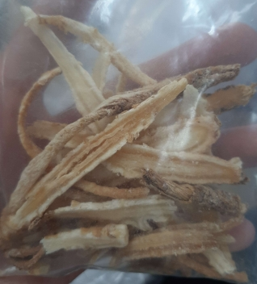
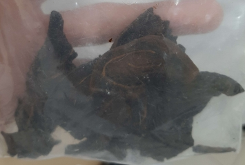
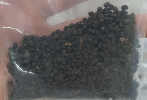
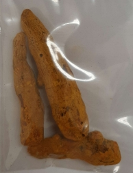
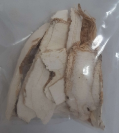
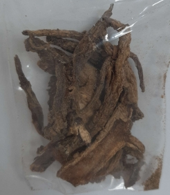
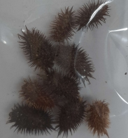
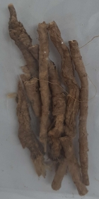
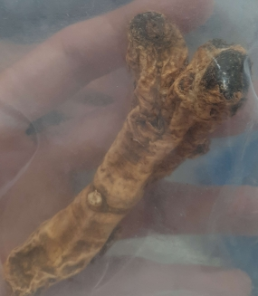

# Một số vị thuốc cổ truyền

> Tác giả **Long Nhật Nguyễn**

## An thần

| Thuốc            | Tác dụng | Hình ảnh                          |
| ---------------- | -------- | --------------------------------- |
| Bá tử nhân       |          |        |
| Bình vôi         |          |          |
| Lá vông nem      |          |       |
| Lạc tiên         |          |          |
| Long cốt         |          |                                   |
| Long nhãn        |          |         |
| Mẫu lệ           |          |                                   |
| Thạch quyết minh |          |  |
| Toan táo nhân    |          |     |
| Viễn chí         |          |          |

## Bổ âm

| Thuốc      | Tác dụng | Hình ảnh                  |
| ---------- | -------- | ------------------------- |
| Bách hợp   |          |                           |
| Bạch thược |          |  |
| Câu kỷ tử  |          |   |
| Mạch môn   |          |    |
| Sa sâm     |          |      |
| Thạch hộc  |          |                           |
| Thiên môn  |          |                           |

## Bổ dương

| Thuốc        | Tác dụng | Hình ảnh                       |
| ------------ | -------- | ------------------------------ |
| Ba kích      |          |       |
| Cẩu tích     |          |      |
| Cốt toái bổ  |          |   |
| Đỗ trọng     |          |      |
| Ích trí nhân |          |  |
| Phá cố chỉ   |          |    |
| Thỏ ty tử    |          |     |
| Tục đoạn     |          |      |

## Bổ huyết

| Thuốc         | Tác dụng | Hình ảnh                        |
| ------------- | -------- | ------------------------------- |
| Đương quy     |          |      |
| Hà thủ ô đỏ   |          |       |
| Kê huyết đằng |          |  |
| Thục địa      |          |       |

## Bổ khí

| Thuốc      | Tác dụng | Hình ảnh                   |
| ---------- | -------- | -------------------------- |
| Bạch truật |          |  |
| Cam thảo   |          |    |
| Đại táo    |          |     |
| Đẳng sâm   |          |    |
| Hoài sơn   |          |    |
| Hoàng kỳ   |          |    |

## Hành khí

| Thuốc         | Tác dụng | Hình ảnh           |
| ------------- | -------- | ------------------ |
| Bạch đậu khấu |          |  |
| Chỉ thực      |          |  |
| Chỉ xác       |          |  |
| Đại phúc bì   |          |  |
| Hậu phác      |          |                    |
| Hương phụ     |          |  |
| Mộc hương     |          |  |
| Ô dược        |          |  |
| Sa nhân       |          |  |
| Trần bì       |          |  |

## Hoạt huyết

| Thuốc        | Tác dụng | Hình ảnh                         |
| ------------ | -------- | -------------------------------- |
| Đan sâm      |          | )     |
| Hồng hoa     |          |      |
| Ích mẫu      |          |                                  |
| Khương hoàng |          |  |
| Nga truật    |          |                                  |
| Ngưu tất     |          |      |
| Tô mộc       |          |        |
| Uất kim      |          |       |
| Xuyên khung  |          |   |

## Tán phong hàn

| Thuốc     | Tác dụng | Hình ảnh                         |
| --------- | -------- | -------------------------------- |
| Bạch chỉ  |          |   |
| Kinh giới |          |  |
| Ma hoàng  |          |   |
| Quế chi   |          |    |
| Tân di    |          |     |
| Tế tân    |          |     |
| Tía tô    |          |     |

## Tán phong nhiệt

| Thuốc        | Tác dụng | Hình ảnh                          |
| ------------ | -------- | --------------------------------- |
| Bạc hà       |          |    |
| Cát căn      |          |   |
| Cúc hoa      |          |   |
| Mạn kinh tử  |          |                                   |
| Ngưu bang tử |          |                                   |
| Sài hồ       |          |    |
| Thăng ma     |          |  |

## Tán phong thấp

| Thuốc           | Tác dụng | Hình ảnh                                |
| --------------- | -------- | --------------------------------------- |
| Dây đau xương   |          |    |
| Độc hoạt        |          |         |
| Hy thiêm thảo   |          |    |
| Ké đầu ngựa     |          |      |
| Khương hoạt     |          |      |
| Mộc qua         |          |                                         |
| Ngũ gia bì      |          |       |
| Phòng phong     |          |      |
| Tần giao        |          |         |
| Tang ký sinh    |          |     |
| Thiên niên kiện |          |  |
| Thổ phục linh   |          |    |
| Thương truật    |          |     |
| Uy linh tiên    |          |     |

## Thanh nhiệt giải độc

| Thuốc        | Tác dụng | Hình ảnh                                   |
| ------------ | -------- | ------------------------------------------ |
| Bồ công anh  |          |   |
| Kim ngân hoa |          |  |
| Liên kiều    |          |     |
| Sài đất      |          |       |
| Xạ can       |          |        |

## Thanh nhiệt lương huyết

| Thuốc       | Tác dụng | Hình ảnh                                     |
| ----------- | -------- | -------------------------------------------- |
| Địa cốt bì  |          |   |
| Huyền sâm   |          |    |
| Mẫu đơn bì  |          |   |
| Rễ cỏ tranh |          |  |
| Sinh địa    |          |     |
| Xích thược  |          |   |

## Thanh nhiệt tả hỏa

| Thuốc           | Tác dụng | Hình ảnh                                    |
| --------------- | -------- | ------------------------------------------- |
| Chi tử          |          |           |
| Cối xay         |          |          |
| Hạ khô thảo     |          |      |
| Thạch cao       |          |        |
| Thảo tuyết minh |          |  |
| Tri mẫu         |          |          |

## Thanh nhiệt táo thấp

| Thuốc         | Tác dụng | Hình ảnh                                 |
| ------------- | -------- | ---------------------------------------- |
| Hoàng cầm     |          |   |
| Hoàng liên    |          |  |
| Khổ sâm       |          |     |
| Long đờm thảo |          |                                          |
| Nhân trần     |          |   |
