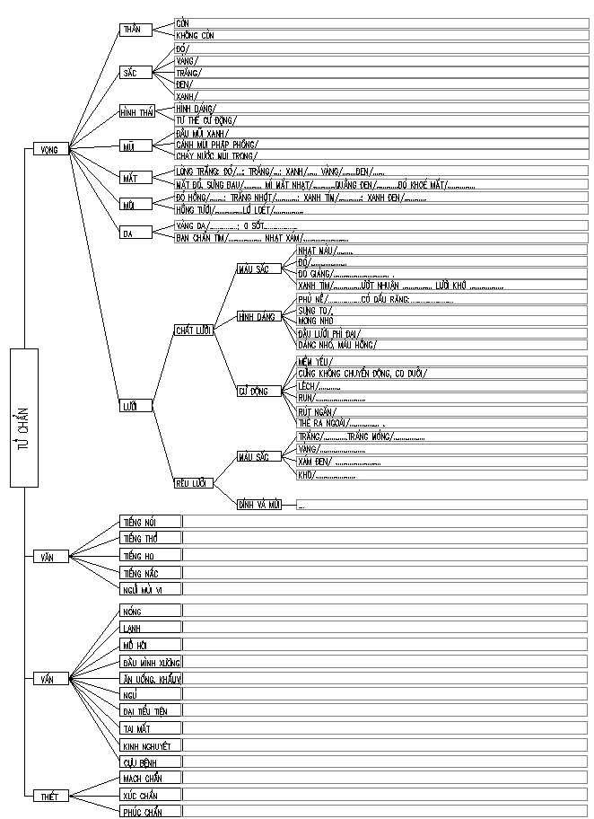

# Tứ chẩn



```
Nhất vấn hàn, nhiệt. Nhị vấn hãn.
Tam vấn ẩm thực. Tứ vấn tiện.
Ngũ vấn thủ, thân. Lục nhãn, lung.
Thất vấn miên, mộng. Bát vấn dục.
Cưu vấn cựu bệnh. Thập vấn nhân.
Phụ nhân vấn gia kinh, đới, sản.
Tiểu nhi dưỡng, phòng, thiên sinh bệnh.
Lão vấn tình chí, mạn tính bệnh.
```